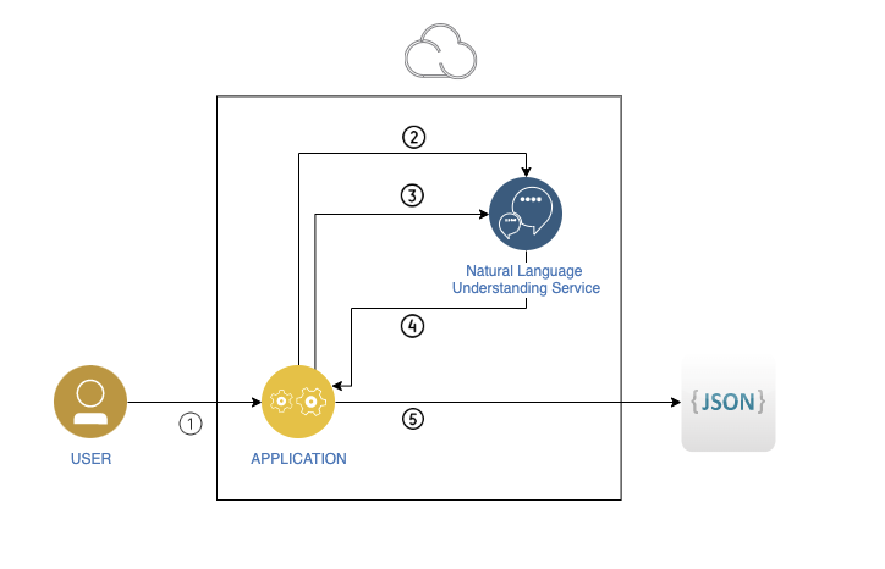
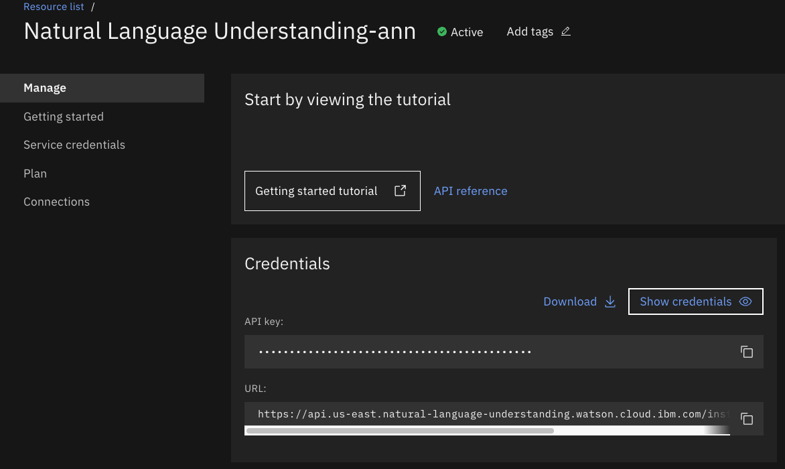
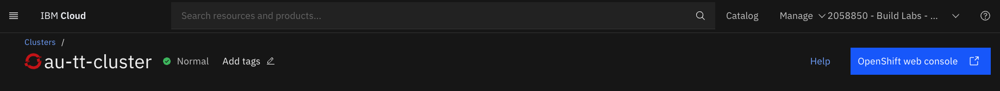
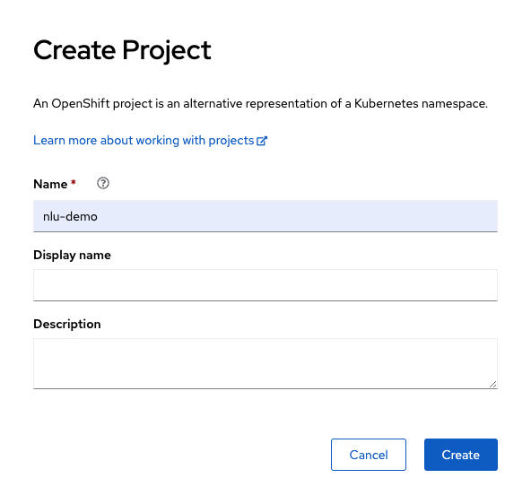
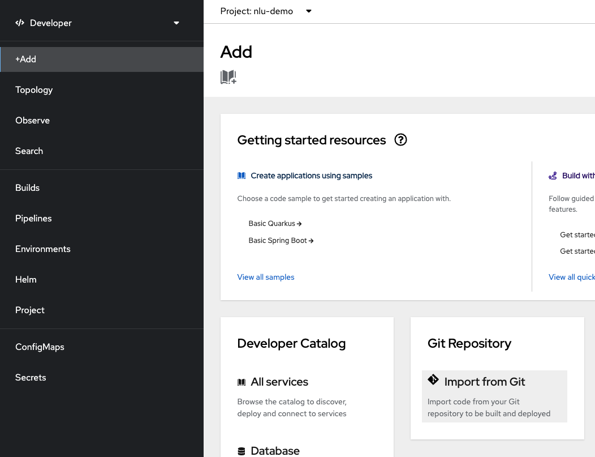
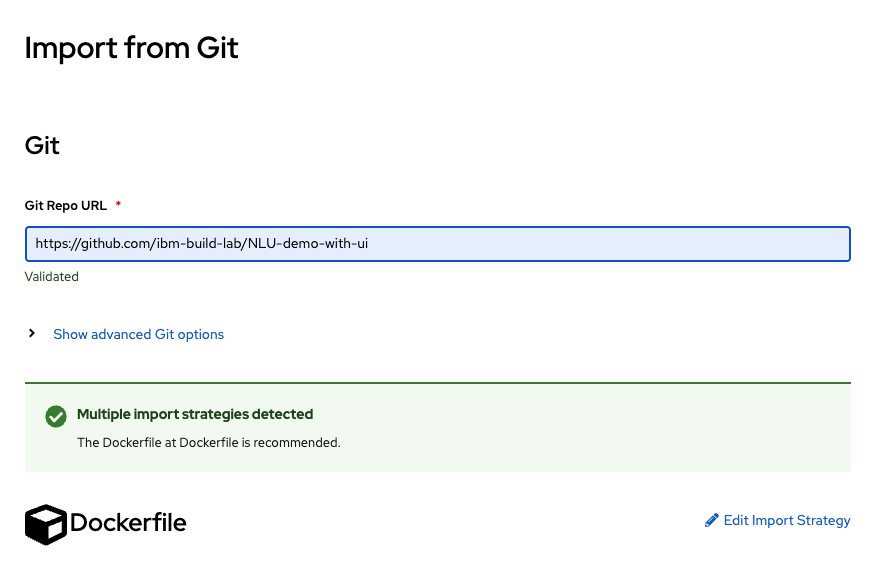
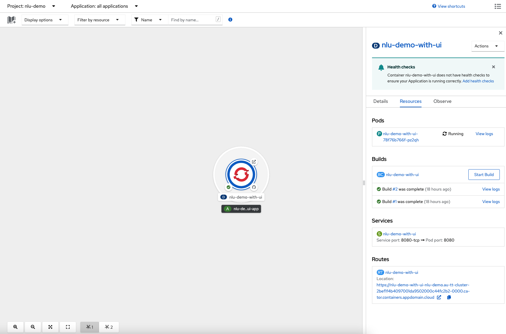
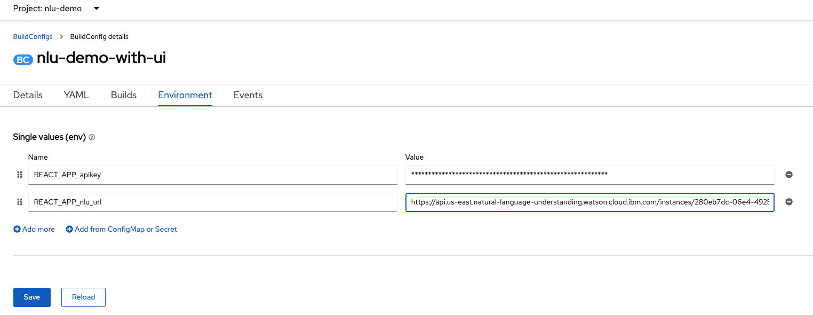
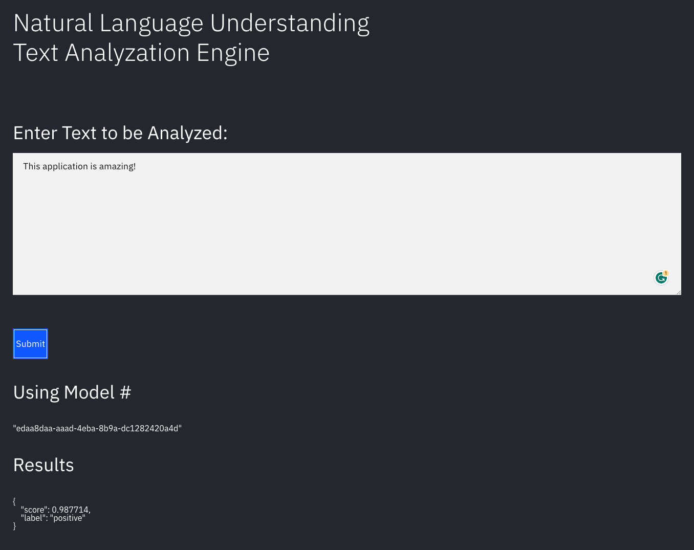

# Natural Language Understand Text Analyzation Demo

## Introduction
In this demo,learn how to create a web app that takes in text and analyzes it for sentiment using the IBM Watson® Natural Language Understanding (NLU) APIs. The user will enter text into a text area and press the "Submit" button.  The text is analyzed based on the **latest loaded model** into an NLU Service.

You will also learn how to deploy this application on an OpenShift cluster using the Developer tools

The main benefit of using the Natural Language Understanding service is its powerful analytics engine that provides cognitive enrichments and insights into data. NLU uses deep learning to extract meaning and metadata from unstructured text data. It uses text analytics to extract categories, classification, entities, keywords, sentiment, emotion, relations, and syntax.

NOTE: The React frontend was created from the [Create React App](https://github.com/facebook/create-react-app) project.



1. User adds text to the application (running locally or in the IBM Cloud).
1. The application requests the latest model from IBM Watson Natural Language Understanding service.
1. The application requests user inputted text to be analyzed using latest model
1. Watson Natural Language Understanding service processes the text and extracts features such as keywords, concepts, categories
1. Results are output to application

## Prerequisites
1. Sign up for an [IBM Cloud account](https://cloud.ibm.com/registration).
1. Download the [IBM Cloud CLI](https://cloud.ibm.com/docs/cli/index.html#overview)

## Estimated Time

2 hours

## Steps

1. [Provision Services and Set Up the Model](#provision-services-and-set-up-the-model)
1. [Create credentials](#create-credentials)
1. [Run the application](#run-the-application)

### Provision Services and Set Up the Model

Set up the services on IBM Cloud and use Watson Studio to create a model to load into the Natural Language Understanding Service.

You can follow the [build-a-recommendation-engine-with-watson-natural-language-understanding](https://developer.ibm.com/tutorials/build-a-recommendation-engine-with-watson-natural-language-understanding/) tutorial to see how to do this.

Once you get to the "Deploy model to Watson Natural Language Understanding" heading you can use this application to analyze text instead of the curl commands. 

### Create credentials

* Open your [Natural Language Understanding](https://cloud.ibm.com/catalog/services/natural-language-understanding) service console.
* Select **Service Credentials**
* Click **New Credential**, and **Add** on the dialog box if you don't already have them. Be sure they have **Manager** authority
* Click the **v** next to the credential to open and see the JSON
* Copy the `apikey` value to use in the next step
* Copy the `url` value to use in the next step

Once credentials are created, they are available on the NLU Service **Manage** page: 


### Run the application

#### Run locally

1. Clone this directory:

   ```bash
   git clone https://github.com/ibm-build-lab/NLU-demo-with-ui
   cd nlu-demo-with-ui
   ```
2. Set environment variables. Create a `.env` file in this top level directory and add the following to it:

   ```bash
   REACT_APP_apikey=<nlu-service-api-key>
   REACT_APP_nlu_url=<nlu-service-url>
   PORT=3000
   ```
3. Compile and start the application:

   NOTE: Node version 12.22.12 or higher required

   ```bash
   npm install
   npm start
   ```
4. The application will be running on `localhost:3000`

#### Deploy to IBM Cloud

1. Provision an [OpenShift cluster](https://cloud.ibm.com/docs/openshift?topic=openshift-getting-started&interface=ui) in your IBM Cloud account
1. Open the OpenShift console by selecting the blue **OpenShift web console** button at the top of the cluster detail page 



1. Create a new project called `nlu-demo`



2. From the OpenShift console, go into the **Developer** view. Select the `nlu-demo` project. Select **+Add**.  Choose `Import From Git`.


3. Be sure to use `Dockerfile` as the method of Import strategy. NOTE: on Openshift Version 8, this choice is made from the `Git Repository` card. On later versions, it is a selection from within the `Import from Git` page.


2. On the `Import from Git` page, enter this repo under `Git Repo URL`.
4. You can keep all the other defaults or change the name   
5. Select **Create**
   
6. Go to **Topology** and open the newly created app icon.  You can watch the progress.


8. Under `Builds`, you should see a `Build Config`. Open it and navigate to the `Environment` tab. Add the `REACT_APP_apikey` and `REACT_APP_nlu_url` environment variables. Start a new build

7. Eventually, the build should complete, the pods should start.

9. Once the build is complete, select the `Location` link under the **Routes** section to see the application

### Usage

Simply insert text into the text box, click **Submit** and you will see the sentiment of the text


## Summary

Using Watson Studio, you can create models and load them into your Natural Language Understanding service. This application will allow you to quickly anaylize text based on the models you load.  You can also look into the code to see how to call the NLU apis from a React application.

## Next Steps

- To change what is displayed from the analyzation, simply edit the `src/App.js` file.  Locate the line (approx line 82):
   ```
   document.getElementById("results").textContent = JSON.stringify(body.sentiment.document, null, 4);
   ```
   Change `body.sentiment.document` to `body` to see the entire response.

   NOTE: if you deployed to the cloud and want to change the code you will need to fork the repo and push your updated code to your new repo, then deploy that repo to the OpenShift cluster. Everytime you change the code in the `git` repo, you will need to restart a new `build`

- If you want to test another model, simply load the model into the NLU service and use the application to analyze text.

## References

[Simple Guide to Deploying a ReactJS Frontend to OpenShift](https://dev.to/ibmdeveloper/simple-guide-to-deploying-a-reactjs-frontend-to-red-hat-openshift-3hp6)

[Natural Language Understanding API documentation](https://cloud.ibm.com/apidocs/natural-language-understanding)

[Server side code in Node to integrate with NLU APIs](https://cloud.ibm.com/apidocs/natural-language-understanding?code=node)

[NLU Code Pattern with full client/server React app](https://github.com/IBM/natural-language-understanding-code-pattern)


